# Getting started with MemodoAI

A guided tour of MemodoAI — what it is, what you can do with it on day one, and the workflows that pay off once you've used it for a few weeks.

This is a working draft intended for polish in Claude Design. Screenshots live in [`screenshots/`](screenshots/); the sample document used in the File Search section lives in [`sample-q3-roadmap-memo.md`](sample-q3-roadmap-memo.md).

---

## 1. Welcome to MemodoAI

MemodoAI is Memodo's internal AI workspace. It looks and feels like ChatGPT, but it runs on infrastructure we control, so internal data stays inside Memodo's environment. You use it the same way you'd use any modern chat assistant — type a question, get an answer — with a few extras that make it more useful for real work:

- **GPT-5** as the default model.
- **Agents** built by colleagues for specific tasks (handbook questions, talent acquisition research, and any you want to add yourself).
- **File Search** so you can ask questions about your own documents.
- **Web Search** so the model can pull in fresh information.
- **Memories** that quietly remember preferences and recent context so you don't have to repeat yourself.

If you've used ChatGPT or Claude before, you already know most of this. This guide just walks you through where things are and the few MemodoAI-specific behaviors that surprise people on day one.

**When to use it.** Drafting, summarizing, explaining, brainstorming, polishing writing, cleaning up notes, asking quick reference questions, working with documents you'd rather not paste into a public service.

**When not to use it.** Anything that requires guaranteed accuracy without you checking the output (legal documents, official numbers, anything customer-facing without review). Treat MemodoAI as a smart first drafter, not a source of truth.

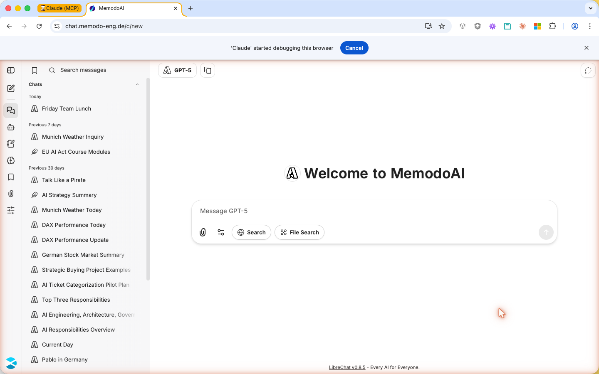

---

## 2. The interface tour

Three regions, left to right:

**Left rail (the icons).** From top to bottom: open/close the sidebar, start a new chat, chat history, **Agent Builder**, **Prompts**, **Memories**, **Bookmarks**, **Attach Files** panel, **Parameters**, and at the bottom your **Account Settings** avatar. Hover over any icon to see its name.

**Conversation sidebar.** Your past chats, grouped by recency (Today, Previous 7 days, Previous 30 days). Click any title to jump back in. The "+" button at the top of the sidebar starts a new chat.

**Chat area.** The big middle column where you actually work. Top bar shows the active model or agent; the composer at the bottom is where you type. The composer has four buttons that change behavior:

- **Paperclip** — attach files (images by default; documents when File Search is on).
- **Sliders** — tweak model parameters for this chat (temperature, max tokens, etc.).
- **Search** — toggle web search on/off.
- **File Search** — toggle document attachment + retrieval (RAG).

The send button (right side) lights up once you've typed something.

> **Note:** The "LibreChat v0.8.5" link in the footer is the open-source platform MemodoAI is built on. You can ignore it — it doesn't go anywhere relevant for daily use.

---

## 3. Your first conversation

Pick a model (it defaults to GPT-5), type into the composer, and press Enter or click the send button. That's it.

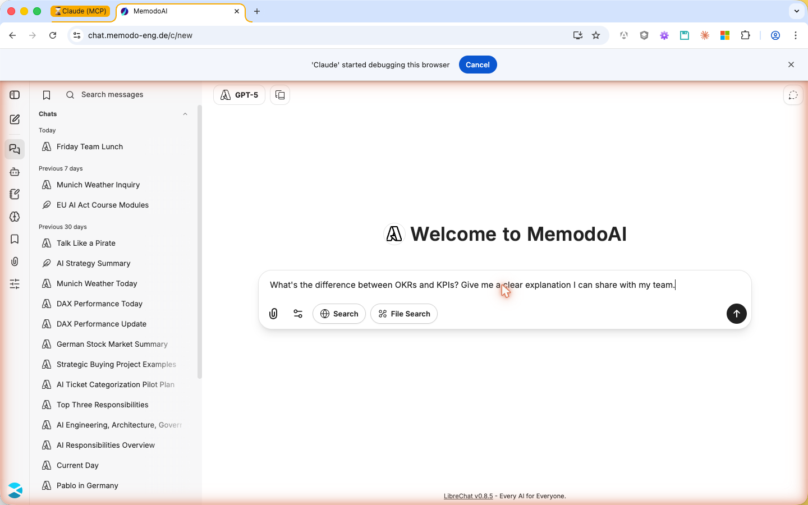

After you send, you'll see your message at the top of the chat area, then the assistant's reply streamed in below.

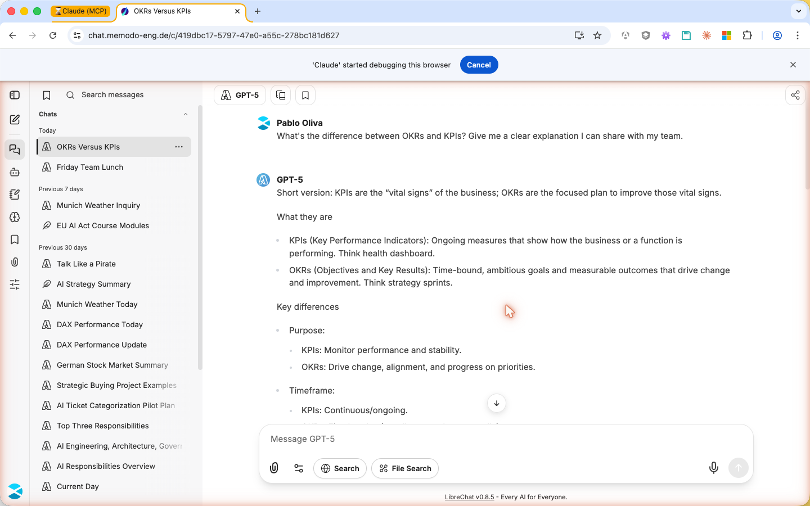

A few things worth knowing:

- **Conversations auto-title themselves.** Right after the model finishes its first reply, MemodoAI will rename "New Chat" to something descriptive (here: "OKRs Versus KPIs"). You can rename it yourself later — hover over the title in the sidebar, click the three-dot menu, choose "Rename".
- **Conversations are saved automatically.** Everything goes into your history unless you use Temporary Chat (see section 6).
- **Each assistant message has a row of action icons** below it: read aloud, copy, edit, fork (continue from this point in a new branch), thumbs up / thumbs down, and regenerate.

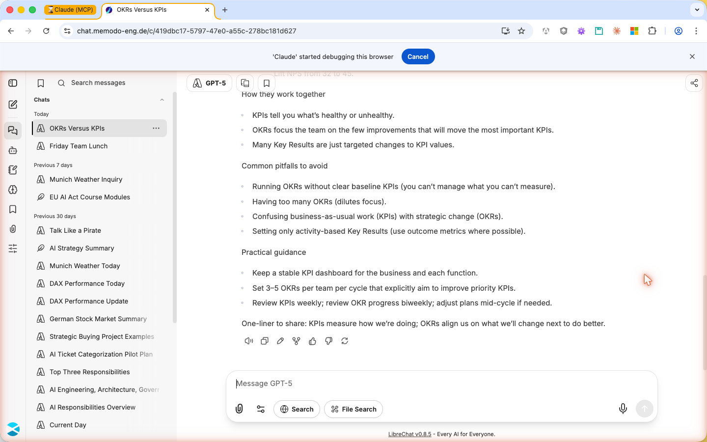

> **Tip:** Editing your own message and re-sending is often better than asking a follow-up. It keeps the context shorter and the model focused. Click the pencil icon on your own message to edit and resend.

---

## 4. Choosing a model

Click the model name in the top bar of the chat area to open the picker. You'll see two groups:

- **MemodoAI** — the base models available in your instance. Right now that's GPT-5, with document upload support.
- **My Agents** — agents that you've built or that someone has shared with you. Selecting an agent here is the fastest way to start a chat with it.

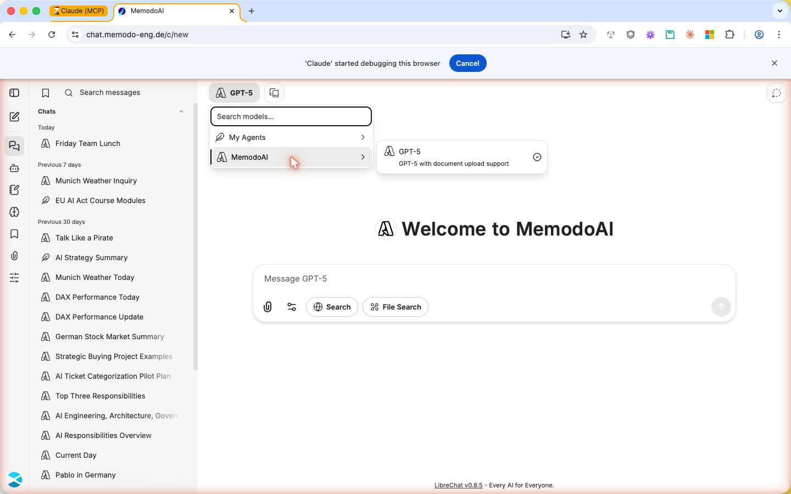

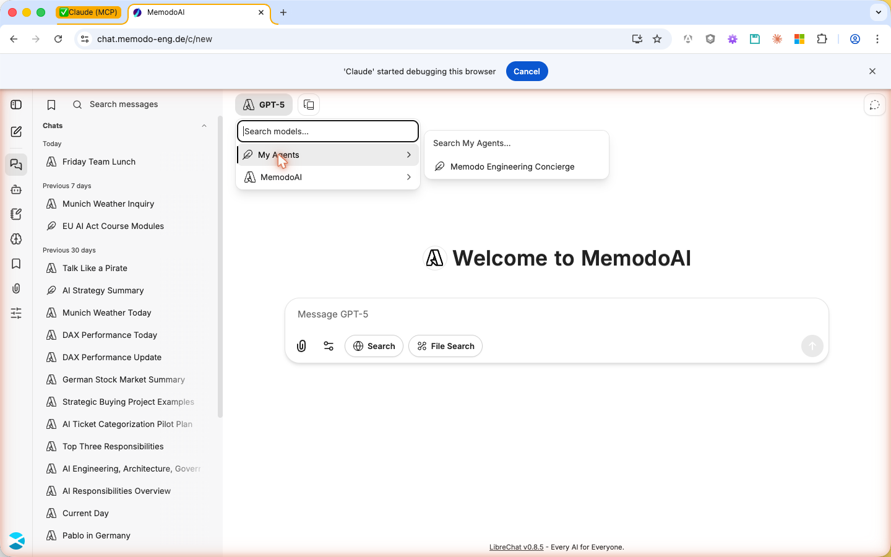

**Which to pick.** For most day-to-day tasks, leave it on GPT-5. Switch to an agent when the agent is built for your specific task — for example, the Memodo Engineering Concierge for handbook questions, or Meeting Notes Polisher for cleaning up rough notes.

---

## 5. Presets vs. agents

Two things that look similar but solve different problems.

**Presets** are saved combinations of model + parameters (temperature, max tokens, frequency penalty, etc.) that you can reuse. The Presets button (next to the model picker) opens this panel:

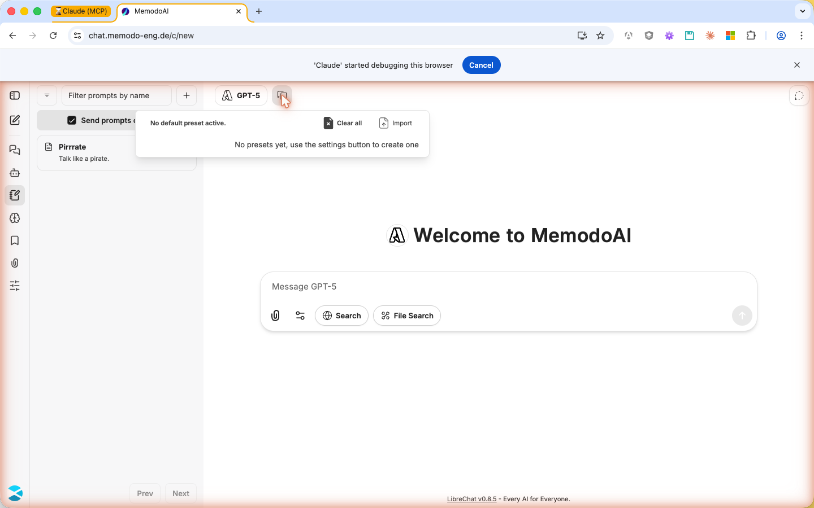

> **Practical advice:** the defaults that MemodoAI ships with have been chosen for sensible behavior across most tasks. Unless you have a specific reason to tweak them (and you understand what each parameter does), **leave the defaults alone**. Changing temperature or top-p without a clear hypothesis usually makes the model worse, not better. If you find yourself wanting a different *behavior* — more concise, more structured, more careful — that almost always belongs in an **agent's system prompt**, not in a preset.

**Agents** are full personas — they have a name, an icon, a system prompt that defines how they behave, optional tools (web search, file search), and a description. Use an agent when the same role keeps coming up: "the person who polishes my meeting notes", "the handbook helper", "the email tone-checker".

Rule of thumb: **presets are an advanced power-user feature; agents are what you'll use day-to-day**. If you're new, ignore presets entirely.

---

## 6. Temporary Chat

The dotted-line icon in the top-right corner toggles **Temporary Chat** mode. When it's on, the composer gets a purple ring, and the conversation isn't saved to your history. Use it for one-off questions you don't want sitting in your sidebar — quick definitions, throwaway brainstorms, sensitive drafts you want to delete the moment you close the tab.

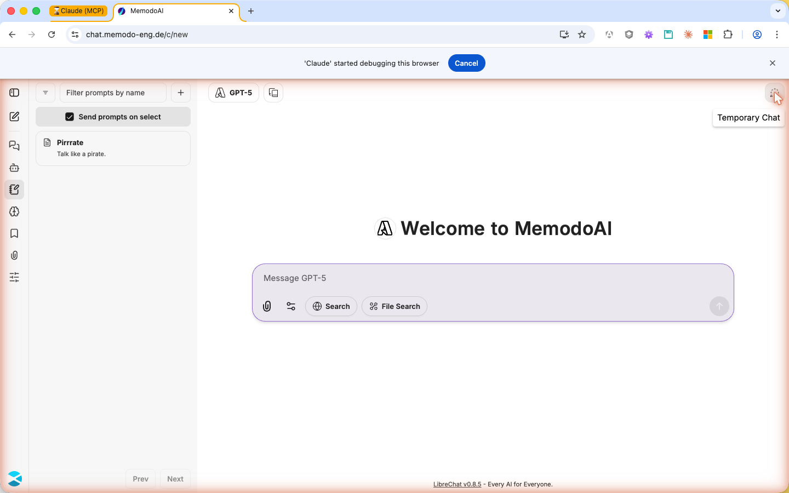

Click the toggle again to leave Temporary mode; closing the tab also ends it. Anything you send in Temporary Chat is gone for good once the chat closes.

---

## 7. Web Search

By default the model only knows what it was trained on, which is months out of date. Flip the **Search** toggle on (in the composer, next to the paperclip) and the model can run real web searches mid-response.

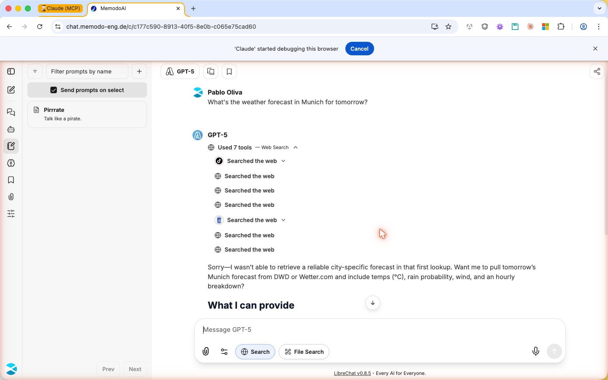

Notice "Used 7 tools — Web Search" at the top of the response: the model decomposed the question into multiple searches automatically. Click the small arrow next to each "Searched the web" entry to see what it actually queried and what came back.

**Good Search use cases:**

- Anything time-sensitive ("What changed in the EU AI Act in 2026?")
- Pricing and availability
- News, sports scores, weather, current exchange rates
- "What's the latest version of \<library\>?"

**When Search struggles:** very specific local data (weather for a small town tomorrow), niche internal corporate info (use the Concierge agent for that), or anything behind a paywall.

If a search comes back unclear, the model usually offers to refine. You can guide it: "Use Wetter.com" or "Try the official source".

---

## 8. File Search — chat with your documents

This is one of the most useful features in MemodoAI. You attach a document, ask questions about it, and the model answers with citations back to the source.

**Step 1: Turn on File Search.** Click the "File Search" toggle in the composer so it turns green. Without this, the paperclip only lets you upload images.

**Step 2: Attach a document.** Click the paperclip — now you have two options:

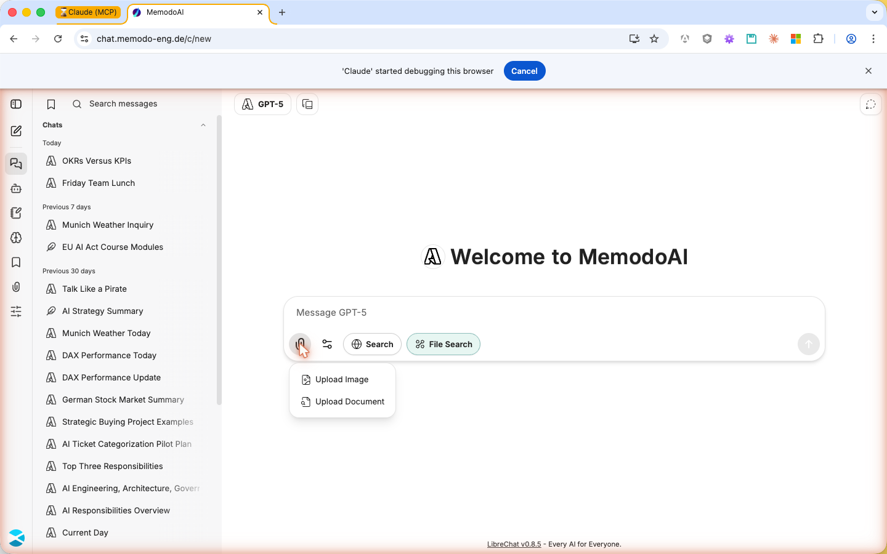

Pick **Upload Document**.

**Supported file types.** MemodoAI accepts the formats you'd expect from a modern office workflow:

| Category | Extensions |
|---|---|
| Documents | `.pdf`, `.docx`, `.doc`, `.rtf`, `.odt` |
| Text & code | `.txt`, `.md`, `.csv`, `.json`, `.xml`, `.html`, `.yaml`, `.log` |
| Spreadsheets | `.xlsx`, `.xls`, `.csv` |
| Presentations | `.pptx`, `.ppt` |
| Source code | `.py`, `.js`, `.ts`, `.java`, `.go`, `.rb`, `.c`, `.cpp`, `.sh`, etc. |

**Not supported via File Search** (you'd need to upload these as images, or extract the text first):

- Images of documents (use a "Upload Image" instead, the model can read them with vision)
- Audio or video files
- Encrypted/password-protected PDFs
- Files larger than the per-upload size limit (currently ~25 MB; if a file is rejected, split it)

Multiple files per chat are fine — just attach them one after another. The model will search across all of them when you ask.

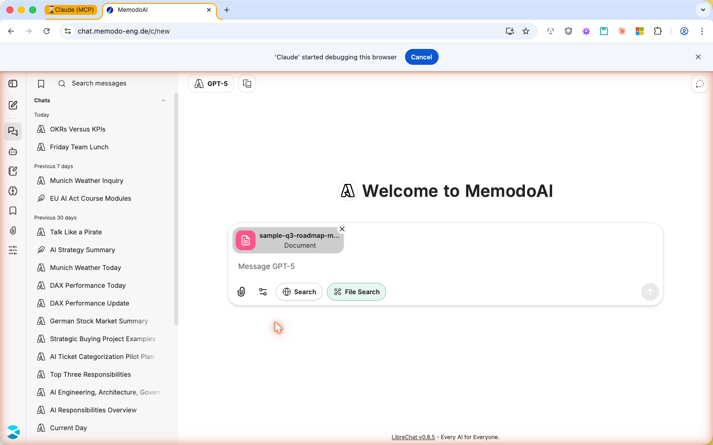

The file appears as a pill above the composer. You can attach more than one.

**Step 3: Ask.** Type your question. The model will search the document and answer with citations.

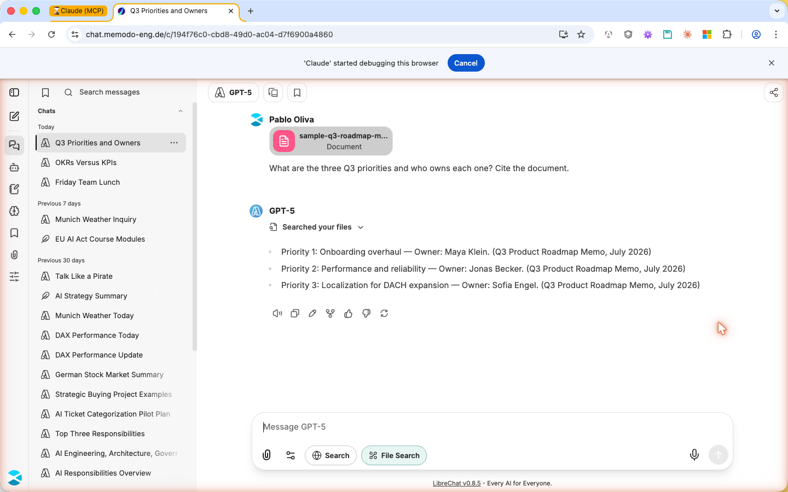

Notice the citations in parentheses — every claim is tied back to the source document. The "Searched your files" expander shows which sections the model actually read:

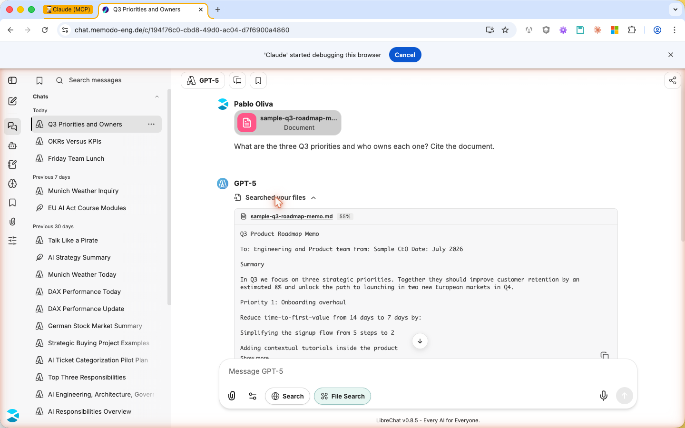

**Tips:**

- One document is fine. Multiple documents is fine too. Pasting a wall of text into the chat is *not* the same — Search builds an index that scales better.
- The relevance score (e.g. "55%") on each retrieved chunk is a confidence indicator, not a quality score. Lower scores still appear when they're the best match available.
- For long documents, ask focused questions ("Who owns Priority 2?") rather than open ones ("Tell me about this doc"). The narrower the question, the better the citation behavior.

---

## 9. Agents

Agents are pre-configured assistants someone built for a specific job. They have their own name, icon, system prompt, and (optionally) tools like File Search or Web Search.

### Using a shared agent

Pick one from the **My Agents** group in the model picker. The chat area changes to show that agent's name and description.

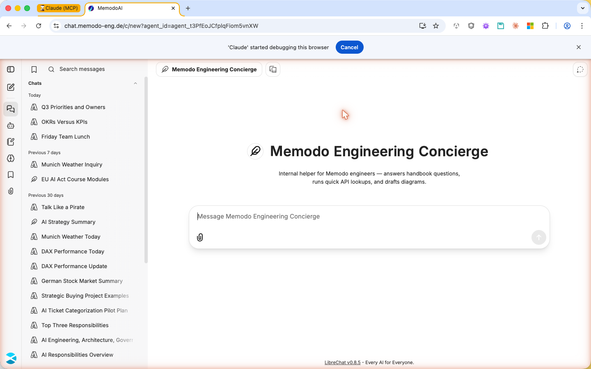

Ask it something. Here, the **Memodo Engineering Concierge** uses its tools to look up internal docs and produces a structured welcome:

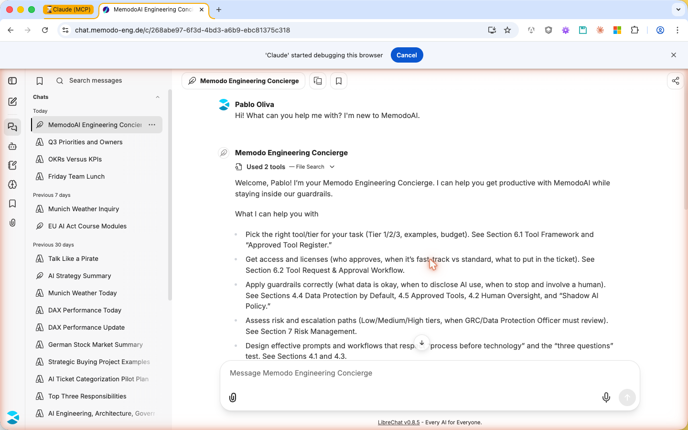

The "Used 2 tools — File Search" line means the agent searched internal sources before answering. Click it to see exactly what it pulled in.

> **Tip:** Agents others built are read-only — you can use them but not edit their instructions. If you want a tweaked version, **clone the behavior** by building your own (next section).

### Building your own

Open the **Agent Builder** from the left rail (the robot/grid icon). If you opened it while a read-only agent was selected, you'll see a "You don't have access to edit this agent" message — that's fine, just click **Create New Agent** at the top.

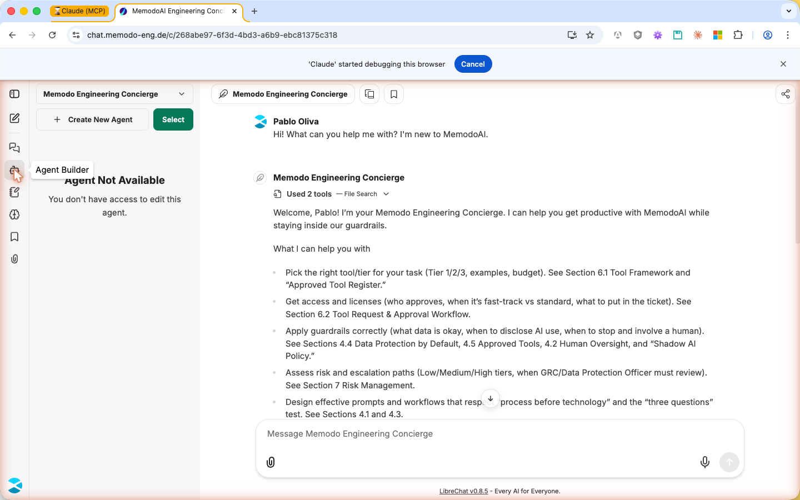

The blank form looks like this:

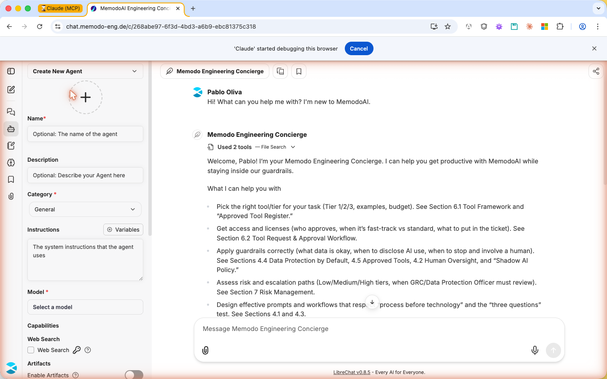

You fill in:

- **Name** — what users see in the picker (required).
- **Description** — short subtitle, shown under the name.
- **Category** — leave on General unless you need to organize many agents.
- **Instructions** — the system prompt that defines how the agent behaves. This is the heart of an agent. Be specific: what input it expects, what output to produce, what tone to use, what *not* to do.
- **Model** — click "Select a model", pick Azure OpenAI as the provider, then gpt-5.
- **Capabilities** — toggle Web Search, File Search, etc. if your agent needs them.

Filled-in example for a "Meeting Notes Polisher":

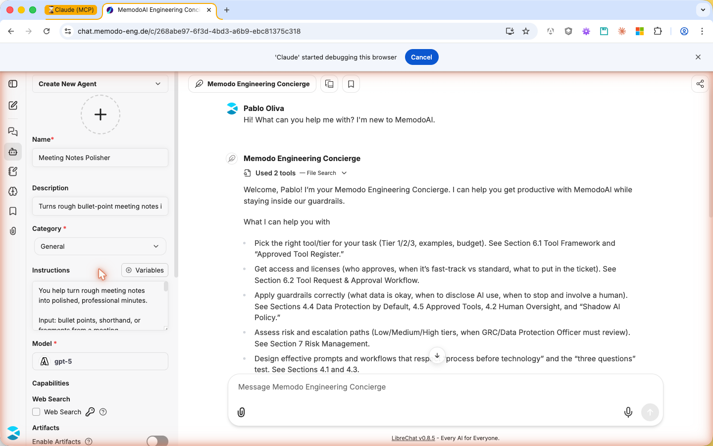

Click **Create** at the bottom. You'll see a green confirmation toast.

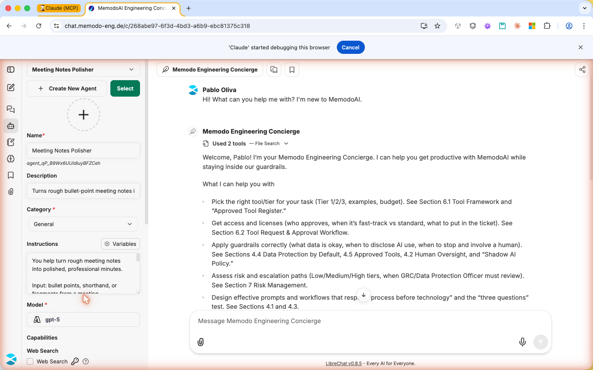

Click **Select** to start using it, or pick it later from the model picker. Test it with something the agent should be good at:

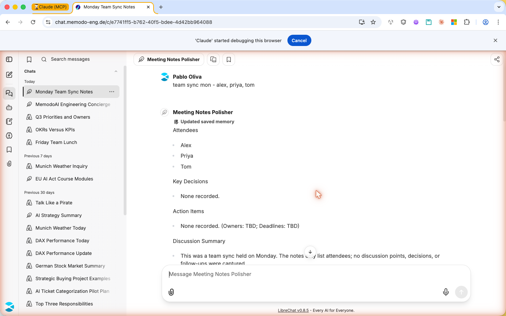

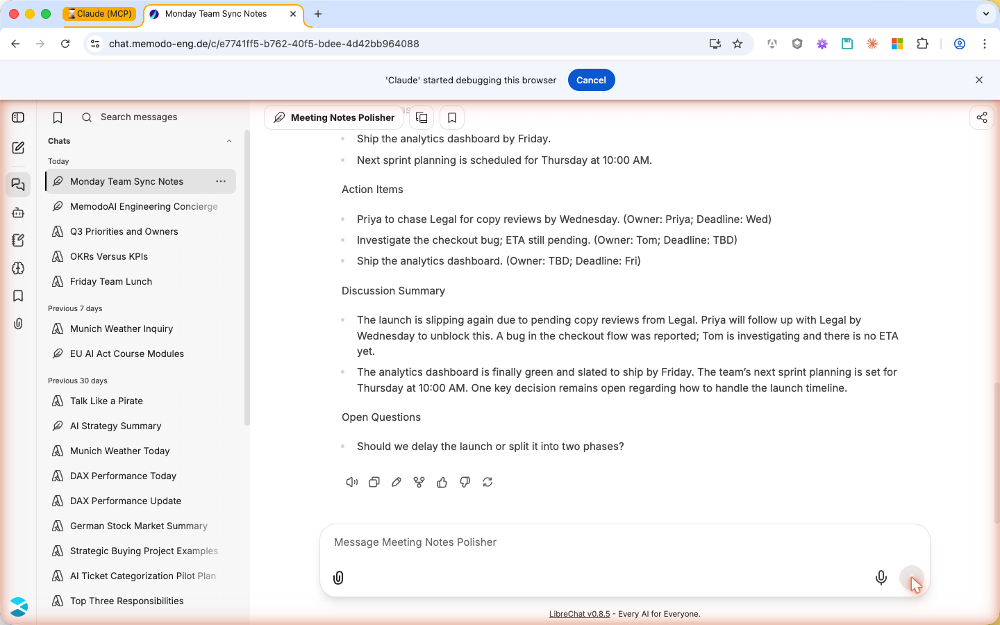

Two things worth noticing in that response:

1. The agent followed its own instructions: structured sections, owners and deadlines extracted, "TBD" wherever the source didn't specify. No invented facts.
2. The "Updated saved memory" indicator means MemodoAI noticed something worth remembering for next time (more on that in section 10).

### Writing good agent instructions

Three rules that go a long way:

1. **Describe input and output explicitly.** "I'll give you X. You produce Y, structured as A/B/C." Models follow shape much more reliably than vibes.
2. **Forbid the failure modes.** "Never invent facts not in the source." "If a field isn't specified, write TBD." These short prohibitions matter more than long descriptions of correctness.
3. **Set the tone in one sentence.** "Professional but warm." "Concise, no preamble." The model will hold the tone if you tell it once.

### Handling multiple variants in one agent

Often you don't want one agent per minor variation — you want **one agent that knows the difference**. For example, a "Meeting Notes Polisher" should clean up team syncs, steering committee notes, and exec-board minutes *differently* — different sections, different formality, different level of detail.

Two patterns, in order of preference:

**Pattern 1 — branching in the system prompt (recommended).** Put all the variants in the instructions and let the agent pick based on the input. Example instruction block:

```
You polish rough meeting notes. First, identify the meeting type from
context (the user may state it, or you can infer from attendees and topic):

(A) Team meeting — informal, short. Output: Attendees / Decisions /
    Action Items / Open Questions. Aim for ~250 words.

(B) Steering committee — semi-formal. Output: Attendees and Roles /
    Topics Reviewed / Key Decisions (with rationale) / Action Items
    (Owner + Deadline) / Risks Raised / Open Items. Aim for ~500 words.

(C) Executive board — formal minutes. Output: Date and Attendees /
    Items on the Agenda / Resolutions Passed (numbered) / Items Tabled
    / Next Meeting. Use third-person, past tense. Aim for ~700 words.

If you can't determine the type, ask before producing minutes. Never
invent attendees, decisions, or numbers that aren't in the source notes.
```

This is reliable: the agent always has all three formats in front of it, and the branching is deterministic.

**Pattern 2 — reference files via File Search (use sparingly).** You can also upload a "house style guide" document (PDF, Markdown, etc.) with detailed format rules and turn on File Search on the agent. The agent will retrieve relevant sections of the guide when asked.

The catch: **File Search retrieves chunks by similarity to the user's message**, not by deterministic routing. If the user says "clean these notes up", the agent might pull the wrong format guide — it's matching the *wording* of the request to the *wording* of the guide, not your intent. Use this pattern when:

- The reference material is large (a 50-page style guide doesn't fit in a system prompt)
- The agent needs to *quote* the guide back to the user
- You can guarantee the user will name the meeting type explicitly

Otherwise, **Pattern 1 is more reliable**. A good rule: put short *routing logic* in the system prompt; put long *reference content* in files.

> **A third option, when variants diverge a lot:** build *separate* agents — "Steering Committee Minutes" and "Exec Board Minutes" as distinct entries. Users pick the right one from the model picker. Less elegant in the picker list, but each agent stays simple and focused.

---

## 9b. Artifacts — interactive output from the chat

When you ask MemodoAI for something visual — a chart, a small UI mockup, a styled table, a code preview — the result can be rendered as an **Artifact**: a self-contained interactive panel that appears next to the chat instead of as a plain code block.

To use it, **build or select an agent with Artifacts enabled**. In Agent Builder, scroll the Capabilities section to find two related toggles:

- **Enable Artifacts** — turns on the feature for this agent.
- **Include shadcn/ui components instructions** — also tells the agent about the `shadcn/ui` component library so it can build cleaner-looking UI artifacts (cards, buttons, forms, tables).

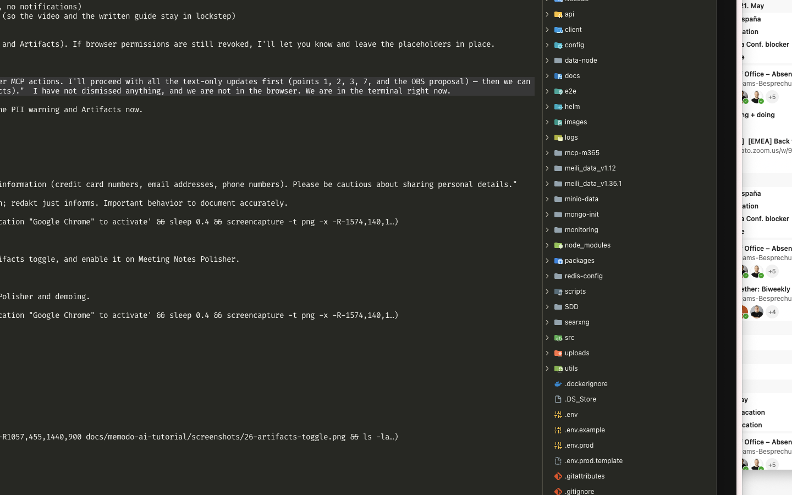

Once enabled, ask for something visual. Examples that work well:

- *"Make me a small interactive checklist of the action items from these meeting notes, with checkboxes and a progress counter."*
- *"Render a chart comparing our Q3 priorities by estimated effort."*
- *"Show me a one-page HTML status board with these three project cards."*

The model produces the code; MemodoAI renders it inline in a side panel next to the chat. The result is fully interactive — clicking checkboxes, scrolling, hovering — and the panel has a Code / Preview toggle so you can see (and copy) the underlying HTML.

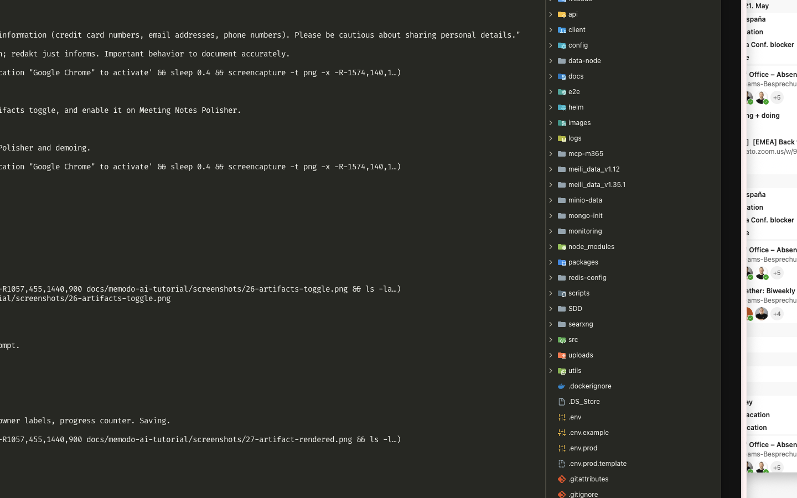

In the chat itself, the artifact shows up as a small clickable card; click it to expand or collapse the side panel.

**Tips:**

- Artifacts are best for **one-off prototypes and visual answers**, not for things you'll edit further in code.
- The progress / state in an Artifact is local — checkboxes you tick aren't saved server-side. To capture a moment, take a screenshot.
- If your Artifact looks broken, ask "show me what code you generated" — the model will often catch its own bug on the next iteration.
- Artifacts run client-side in MemodoAI; no external services are called.

---

## 10. Memories

MemodoAI remembers context across chats so you don't have to keep re-introducing yourself. Things like your name, your role, projects you mentioned, and recurring people you work with get quietly saved.

Click the brain icon in the left rail to see what's saved:

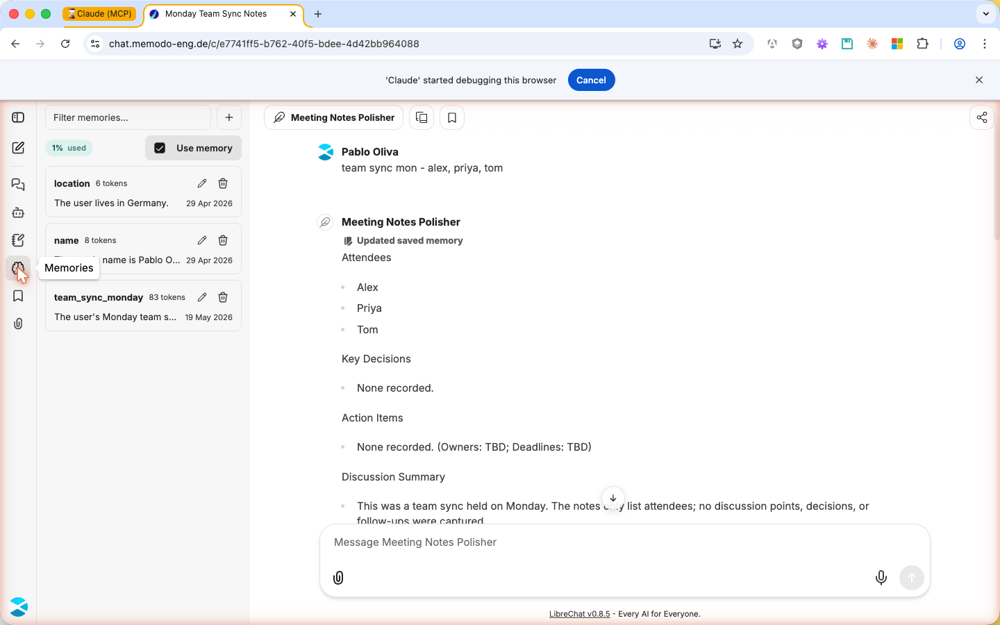

Each memory has:

- A **key** (short identifier, e.g. `team_sync_monday`)
- A **value** (the actual content)
- A token count and a creation date
- Edit and delete buttons

The "Use memory" toggle at the top controls whether the model has access to memories during your chats. Turn it off if you want the model to behave like it's never met you (useful for testing prompts).

Click the pencil icon to edit any memory — you can rewrite or shorten the content:

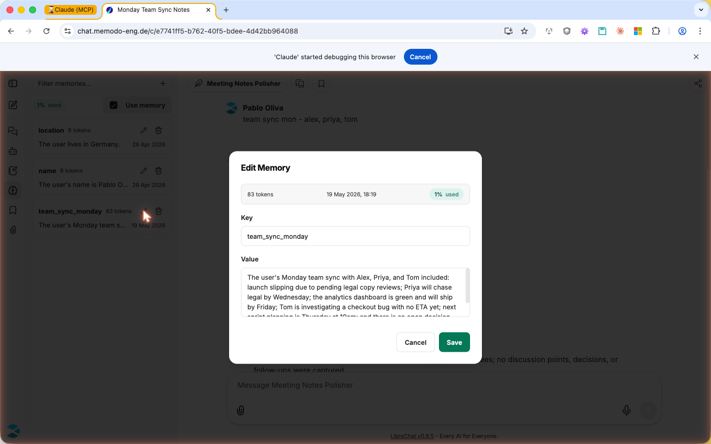

> **Privacy note:** Memories are tied to your account only — nobody else can see them. Delete anything you don't want stored.

---

## 11. Prompts

The Prompts panel (pencil icon in the left rail) is a personal library of reusable prompts. Useful for things you ask repeatedly: "Translate this to German, formal tone", "Summarize this email in three bullets", "Convert this rough text into a Slack-ready announcement".

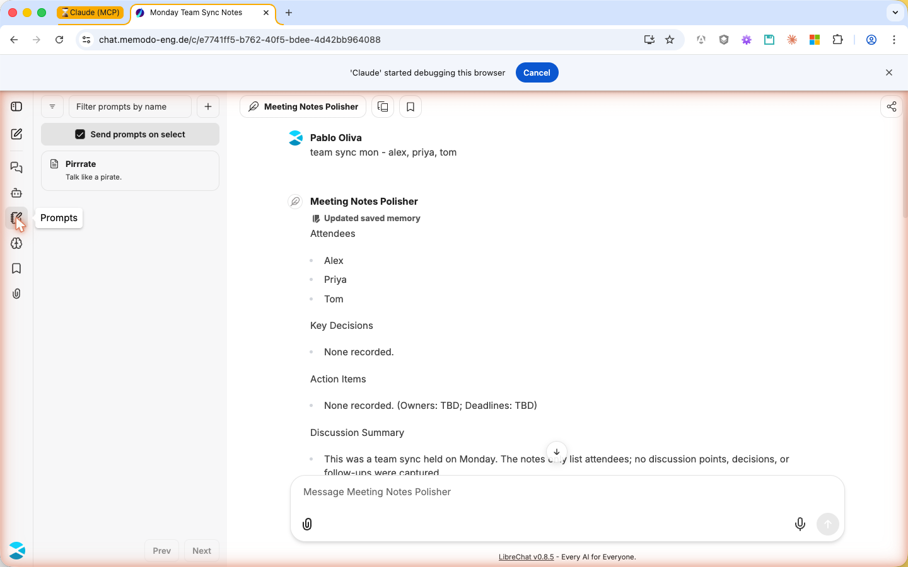

Click the "+" button to create one:

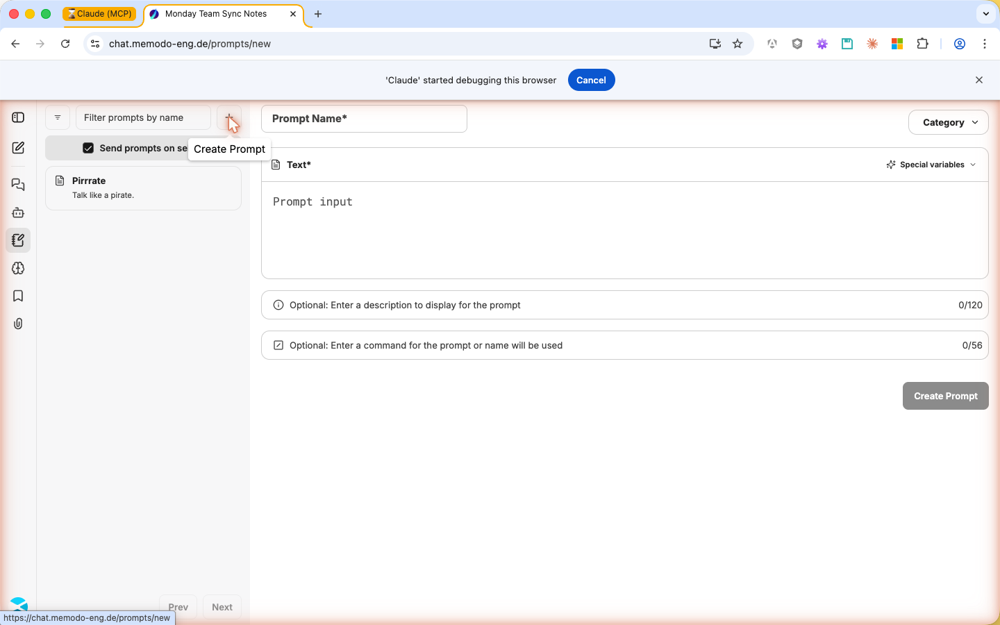

A prompt has:

- **Name** — what shows in your library.
- **Category** — optional grouping.
- **Text** — the actual prompt body. You can use template variables (the **Special variables** button shows what's available — things like `{current_date}`).
- **Description** — what the prompt is for.
- **Command** — an optional slash-trigger you can type in the composer to instantly load this prompt.

With "Send prompts on select" checked at the top of the panel, clicking a saved prompt sends it immediately. Uncheck it if you'd rather paste the prompt into the composer first to edit it.

**Prompts vs. agents**: a prompt is a one-shot instruction; an agent is an ongoing persona. If you find yourself selecting the same prompt every day, that's a sign it should be an agent instead.

---

## 12. Bookmarks

Bookmarks are tags you can apply to conversations to find them later — useful once you have a long chat history. Open a conversation, click the **bookmark icon** in the top bar of the chat area, then **New Bookmark**:

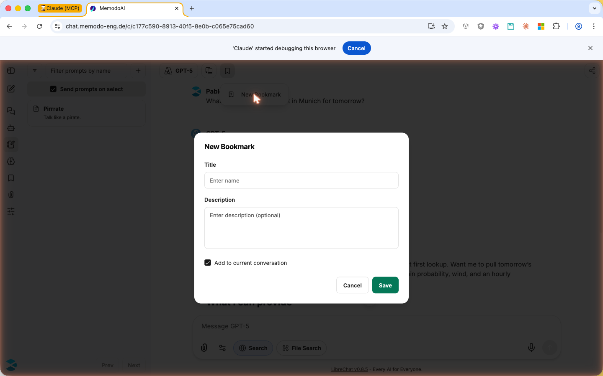

Give the bookmark a title (a category, really) and an optional description. The "Add to current conversation" checkbox tags this conversation with the bookmark on the spot. Later, you can browse bookmarks from the bookmark icon in the left rail.

Common categories: "Project X", "Reference", "To revisit", "Templates".

---

## 13. Sensitive data — PII warnings

MemodoAI quietly scans the text of your messages before it sends them, looking for things that look like **personal or sensitive data**. If it finds something, you'll see a warning prompt — that's a chance to stop and think before the message leaves your browser.

**What triggers a warning.** The PII detector is tuned to recognize patterns like:

- Names and email addresses (real people, not "the user")
- Phone numbers, postal addresses
- Government IDs (SSN-style numbers, tax IDs, passport numbers)
- Financial data — credit card numbers, IBANs, bank account numbers
- Health information — patient IDs, conditions tied to a named individual
- Other regulated identifiers (driver's licenses, employee IDs, etc.)

**What you'll see.** When you send a message containing detected PII, an orange banner pops up at the top of the screen identifying the categories that were flagged. The message **still goes through to the model** — the warning is informational, not blocking — so this is a "heads up" rather than a hard stop.

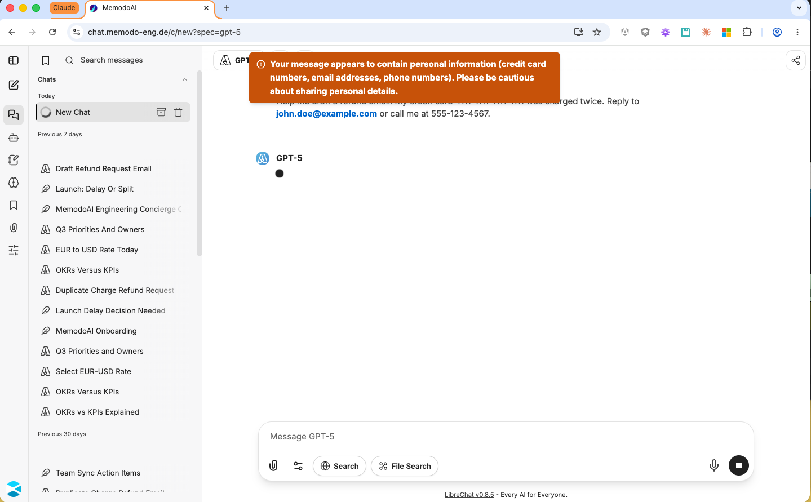

In the example above, the banner reads: *"Your message appears to contain personal information (credit card numbers, email addresses, phone numbers). Please be cautious about sharing personal details."*

**What to do when a warning appears.**

1. **Read it carefully.** Sometimes the detector flags something innocuous (a fictional name in a sample sentence, a fake credit card you used as a placeholder). Sometimes it's a real catch.
2. **If you noticed mid-send:** because the warning is informational, the model is already processing the message. Use the **Stop generating** button in the composer if you want to halt the response. Then delete the conversation if the data shouldn't be in your chat history.
3. **If it's real data you don't need:** edit the message, replace the sensitive value with a placeholder ("[customer-name]", "[card]") or remove it entirely, then re-send.
4. **If you genuinely need to discuss real data:** consider whether MemodoAI is the right tool for this question at all. For most analyses you don't actually need the real identifier; you can describe the pattern in the abstract.

**Behind the scenes.** The PII warning is powered by **redakt**, an internal Memodo service that runs the detection. It can operate in two modes:

- **Warn mode** (current default in this instance) — surfaces a warning banner after send, but lets the message through. Use it to teach habits.
- **Detect mode** — silently logs detections without interrupting the flow (used for monitoring, not for warning).

Your instance's current mode is set by IT/Compliance; if you're not sure which one is active, ask your IT champion.

**A few realities to internalize.**

- The detector isn't perfect. It can miss things (especially unusual formats or non-English data) and it can flag false positives. **Treat it as a safety net, not a checkpoint.** You're still responsible for what you send.
- If you keep getting warnings on the same prompt, that's a signal you're working in the wrong tool. Move that conversation to a system designed for the data classification.
- Conversations where you bypass a warning may be reviewed by Compliance under standard policy. Don't take it personally — assume it could be.

---

## 14. Common workflows

Three concrete recipes you can copy directly.

### Recipe 1 — Summarize a long document

1. Toggle **File Search** on.
2. Click the paperclip → **Upload Document**, pick the file.
3. Ask: *"Give me a one-paragraph executive summary, then a bullet list of the top five risks or decisions. Cite the section for each bullet."*
4. If a bullet looks fuzzy, click the "Searched your files" expander to see the source. Then ask follow-ups: *"For the risk on legal review — what does the document say about the mitigation?"*

### Recipe 2 — Clean up rough meeting notes

1. From the model picker, pick **Meeting Notes Polisher** (or any similar agent in your instance).
2. Paste your rough notes — bullet points, half-sentences, attendees, whatever you have.
3. Review the structured output. Anything marked **TBD** is something the agent couldn't find in your notes; fill it in by replying with the missing info, or edit the message and re-send.
4. Copy the result to Slack, Confluence, wherever it needs to go.

### Recipe 3 — Get an answer that needs fresh data

1. Toggle **Search** on in the composer.
2. Ask the question naturally — *"What's the current EUR-USD rate? What was it a year ago? Show me both."*
3. Check the "Used N tools — Web Search" section to see which sources the model pulled from. If a number seems off, ask: *"Where did the year-ago rate come from? Is the source reliable?"*

### Recipe 4 — Build a personal agent for a recurring task

If you find yourself typing variants of the same prompt every few days, it's time for an agent:

1. Open **Agent Builder** (robot icon in the left rail) → **Create New Agent**.
2. Write 5–10 lines of instructions describing: input shape, output shape, the tone, and the one or two things the agent must *not* do.
3. Pick `gpt-5` as the model. Turn on Web Search or File Search if the agent needs them.
4. Save, test, refine the instructions, save again. Three iterations is normal.

---

## 15. Tips, limits, and getting help

**Be specific.** "Make this professional" is vague. "Rewrite this email so it sounds direct but warm, three short paragraphs, no greeting" is actionable.

**Edit before you re-ask.** Re-sending a slightly clearer prompt almost always beats trying to steer the model through a long follow-up.

**Don't paste sensitive customer data into a chat unless you have to.** MemodoAI runs in our environment, but the principle of minimal data still applies — if the task doesn't need real names or numbers, redact first.

**The model can be wrong.** Always check facts that matter. The model is a very fast drafter, not an oracle.

**Files are processed; they're not stored long-term as you'd expect.** Uploaded documents go through retrieval when you ask about them. If you delete a conversation, the corresponding file context is gone too.

**Memories can be deleted.** Anything stored in the Memories panel can be removed with the trash icon. Do this if you're not sure something should be persisted across chats.

### Getting help

Click your avatar at the bottom-left of the screen to open the account menu:

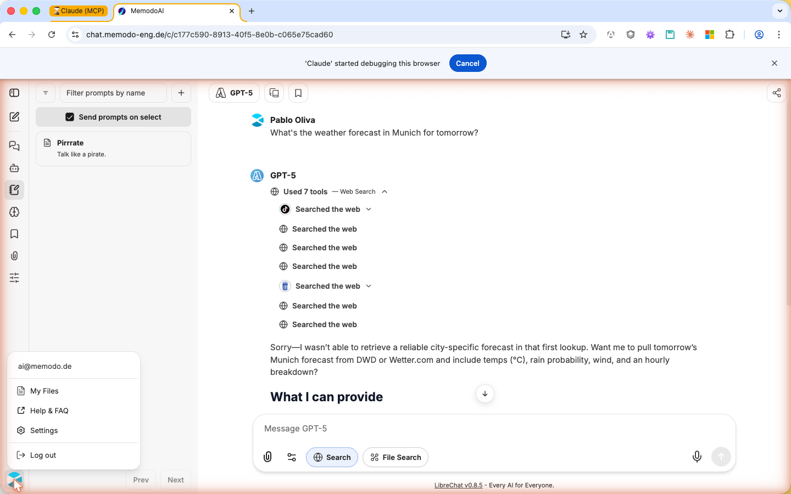

- **My Files** — files you've uploaded.
- **Help & FAQ** — the upstream help docs.
- **Settings** — UI preferences, language, theme.
- **Log out** — for shared computers.

For Memodo-specific questions (a custom agent isn't behaving, you want to share an agent with the team, you've found a bug) — reach out to your AI/IT champion or the Memodo Engineering Concierge agent.

---

*Last updated: 2026-05-19. Draft for Claude Design polish.*
