# What's New in MemodoAI (July 2026)

A short companion to the main [Getting Started guide](../getting-started/memodo-ai-tutorial.md). It covers the
features that arrived in the **July 2026 update** — a platform upgrade plus a brand-new **Microsoft
365** connection. If you're new to MemodoAI, read the Getting Started guide first; this one assumes
you already know the basics (chatting, the model picker, agents, file search).

---

## 1. What changed, in one minute

Two things happened in this update:

1. **MemodoAI can now read your Microsoft 365 data** — your Outlook mail, calendar, OneDrive and
   SharePoint files, Excel sheets, OneNote, tasks, and contacts — right inside a chat, on your
   behalf and read-only. This is the headline feature (section 2).
2. **The platform underneath was upgraded**, which brings **Skills** (reusable playbooks you invoke
   on demand), **Projects** (folders for your chats), a **context-usage meter**, richer file
   previews, and a handful of smaller quality-of-life improvements (sections 3–6).

Everything you already know still works the same way. Nothing was taken away.

---

## 2. Microsoft 365 — your mail, calendar, and files in a chat

This is the biggest addition. You can now ask MemodoAI questions about your own Microsoft 365
content and it will read the relevant items and answer — without you copying anything in.

**How it works, plainly.** Microsoft 365 is connected through an **MCP server** ("Model Context
Protocol" — a standard way to plug an external tool or data source into the assistant). When you
turn it on, MemodoAI can call Microsoft on your behalf to read your data. Three things are true and
worth understanding before you use it:

- **It runs as *you*.** Every request uses your own Microsoft sign-in, so the assistant can only
  ever see what *you* could already see. It cannot reach a colleague's private mailbox or a site
  you don't have access to.
- **It's read-only.** In this first phase the assistant can *read* your mail, calendar, and files —
  it **cannot send mail, create calendar invites, or change files.** Anything that would write is
  blocked on Microsoft's side.
- **Your PII safety net still applies.** Content the assistant reads back (mail bodies, contact
  details, file contents) passes through the same personal-data detection described in the Getting
  Started guide (section 13). The safety net covers fetched data, not just what you type.

### Turning it on

Microsoft 365 lives in the composer's **MCP Servers** button — the same row as Search and File
Search. Click **MCP Servers**, then tick **Microsoft365**. That enables it for the conversation, and
because you sign in to MemodoAI with your Microsoft account, it acts on your behalf using your own
access.

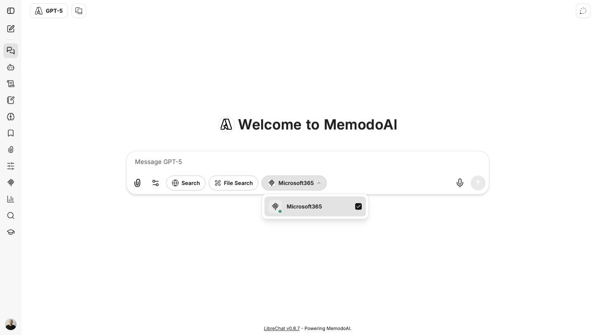

> **If Microsoft 365 stops responding, reconnect it.** When the connection is healthy, the
> **Microsoft365** entry in the **MCP Servers** menu shows a small **green dot**. It won't
> necessarily stay live for the whole session, though — the connection can drop (for example when
> your session ages out), and while it's disconnected any Microsoft 365 request fails. To restore it,
> open the **MCP Servers** menu and click the small **plug icon** next to **Microsoft365** (just left
> of its checkbox); in the dialog that appears, click **Initialize**. It reconnects in a second or
> two — the status flips to **Active** with a green dot — and you can carry on.

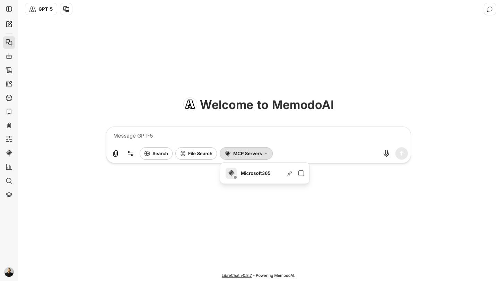

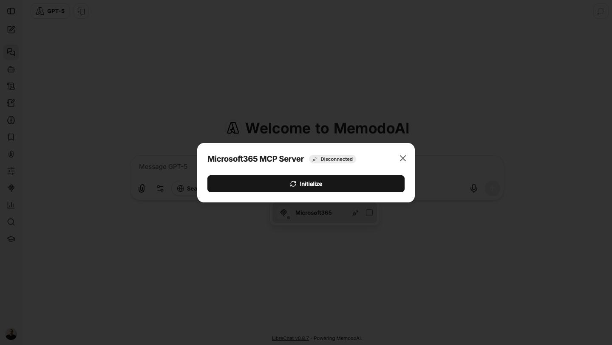

### What you can ask

Once it's on, ask naturally. The assistant figures out which part of Microsoft 365 to look in.

| You want to… | Try asking |
|---|---|
| Triage mail | *"Summarize the unread mail from my manager this week."* |
| Prep for a meeting | *"What meetings do I have Thursday, and who's attending the 2pm one?"* |
| Find a document | *"Find the latest Q2 roadmap deck in my OneDrive and pull out the OKR slide."* |
| Check your tasks | *"What's on my To Do list that's due this week?"* |
| Search SharePoint | *"Search SharePoint for the latest signed MSA for ACME GmbH."* |
| Look up a contact | *"What's the email address I have on file for Jane at ACME?"* |

The assistant can read across **Outlook mail, Calendar, OneDrive & SharePoint files, Excel, OneNote,
To Do, Contacts, and a cross-service search**, plus your basic profile.

When it uses Microsoft 365, you'll see a line naming the tool it ran — for example **"Ran
get-current-user in Microsoft365"** — just under the assistant's name. Click it to expand exactly
what it looked at.

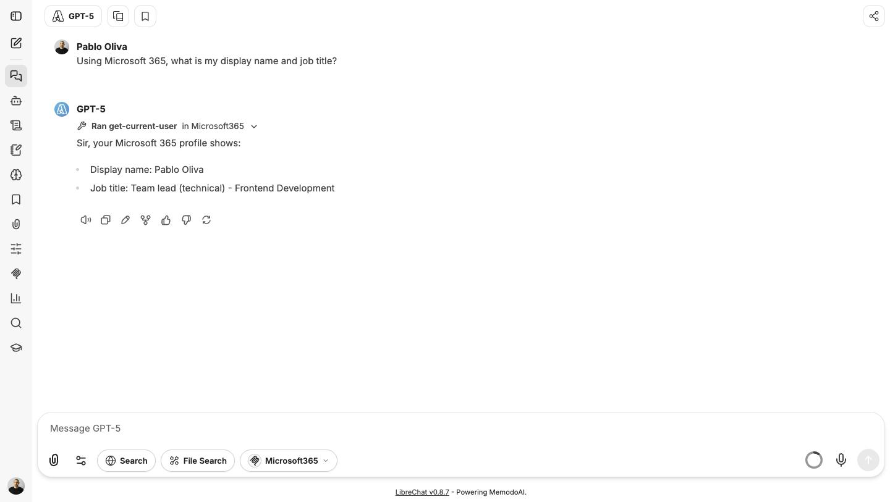

### Getting good results

- **Name a target.** "Find *the ACME MSA* in *SharePoint*" works better than "find my important
  documents." The assistant is deliberately steered *not* to trawl your whole mailbox or drive
  without something specific to look for — so give it a sender, a folder, a keyword, or a date
  range.
- **It's read-only** — if you ask it to send or delete something, it will try and Microsoft will
  refuse. Use it to *find and reason over* your data, then act in Outlook/Teams yourself.
- **Mind what you pull in.** Because responses can now contain real mail and contact details, the
  PII warning may appear more often. That's working as intended — see section 13 of the Getting
  Started guide.

---

## 3. Skills — reusable playbooks you pull in on demand

**Skills** are the second-biggest change. A skill is a small, reusable "how we do X" module — a set
of instructions (and optionally reference files) that the assistant loads **only when the task
calls for it**, instead of you re-typing the same guidance every time.

**Why this is different from what you already have.** Think of the three tools you now have for
"reusing instructions":

| | What it is | When it's loaded |
|---|---|---|
| **Prompt** (Getting Started §11) | A one-shot piece of text you insert | When you pick it |
| **Agent** (Getting Started §9) | A whole persona — system prompt + model + tools | Always, for that agent |
| **Skill** (new) | A reusable procedure/knowledge module | Only when the task needs it — advertised cheaply by name, the full body pulled in on demand |

The clever part is **progressive disclosure**: MemodoAI always knows a skill's *name and one-line
description* (cheap), but only reads the full instructions — and any attached reference files — when
a task actually matches. That means an assistant can "know" a large library of procedures without
carrying all of them in every conversation.

### Finding and using a skill

Your skills live in the **Skills panel** — open it from the **Skills icon in the left rail**. That's
where you create, edit, enable, share, and organize them.

To *use* a skill in a chat there are two routes:

- **Let the assistant pick it.** An enabled skill is applied automatically when your request matches
  its description and its "When to use" note (see below) — you don't have to do anything.
- **Invoke it by name.** Type **`$`** in the message box and a **"Select a Skill by name"** picker
  appears, listing your skills and their descriptions; choose one to apply it to your message.

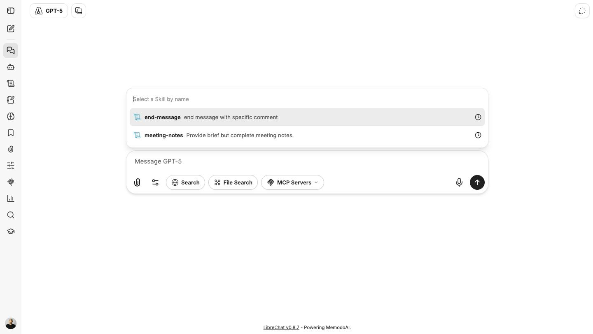

For example, invoking `meeting-notes` on a rough team-sync transcript returns clean sections —
attendees, decisions, action items with owners and due dates, and open questions. That structure
comes from the skill, not from you asking for it.

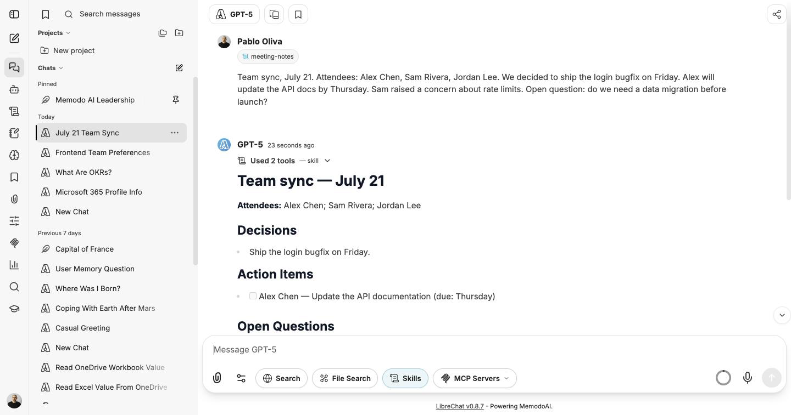

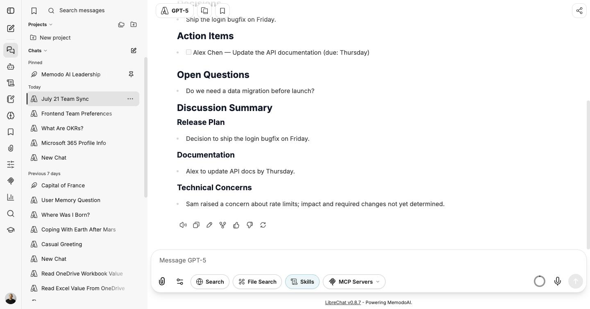

### Walkthrough — creating your own skill

Say your team always processes a warranty claim the same way. Instead of an agent or a copy-pasted
prompt, make it a skill:

1. **Open the Skills panel** from the left rail, click **+**, and choose **Write skill
   instructions** (or **Upload a skill** if you have a prepared skill file to import).
2. Give it a **Name** — e.g. `warranty-claim`.
3. Write a **Description**. This is the single most important field: it's how the assistant decides
   *when* the skill is relevant, so be specific — *"Turn a customer's warranty complaint into a
   structured claim record."* (The form itself reminds you to "be specific about when this skill
   should apply.")
4. Write the **Instructions** in Markdown — the "how we do it" body. A good pattern, borrowed from
   the skills already in this instance, is three headings: **When to use** (the trigger),
   **Procedure** (the steps, in order), and **Output format** (the exact shape to produce). Same
   discipline as a good agent prompt: be explicit about input and output, and forbid the failure
   modes.
5. Click **Create**.

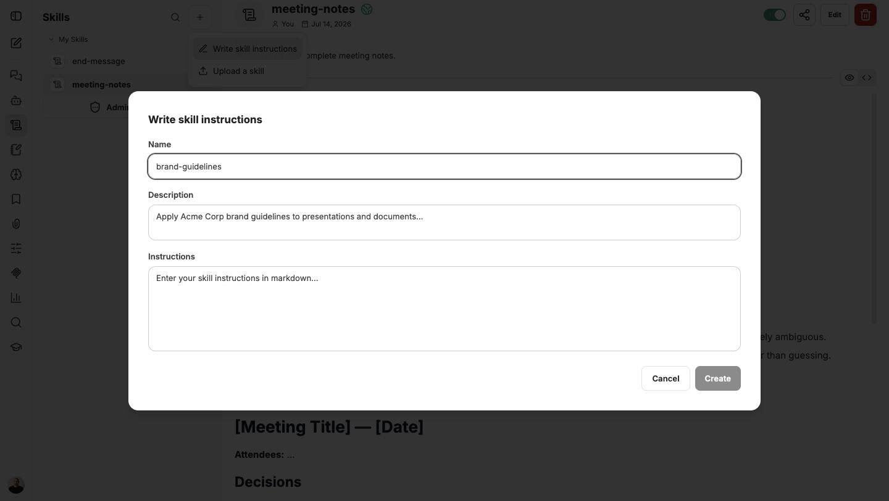

Your new skill appears under **My Skills**. Selecting it opens a detail view where you can toggle it
on or off, **Edit** it, **share** it, assign a **Category**, or see its version. Skills are
**versioned** — editing a shared skill rolls a new version everywhere it's used — so a fix to a
procedure propagates to everyone using it.

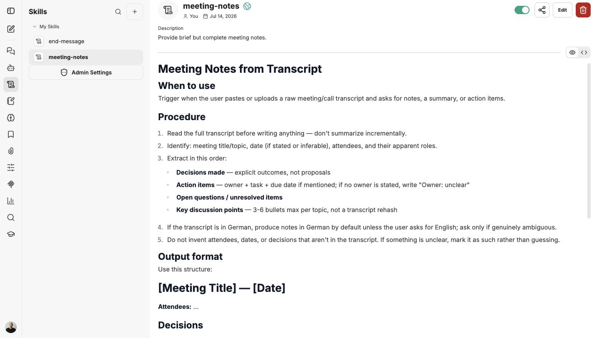

### Skills vs. prompts vs. agents — which to reach for

- Put **small, always-on, agent-specific** guidance in the **agent's prompt**.
- Use a **prompt** for a **one-shot** instruction you fire occasionally.
- Reach for a **skill** when you have **many procedures**, want to **reuse one across chats or
  agents**, want it applied **only for the relevant task**, or want to **version and govern** it
  independently.

> **Governance note.** Who may *author* skills is controlled by an admin setting (the **Admin
> Settings** entry at the bottom of the Skills panel). Combined with versioning and sharing, that
> lets a team curate a trusted, reusable library rather than everyone reinventing the same procedure.

---

## 4. Agent power-ups — chaining and memory

This update switched on two more capabilities. **Chaining** is something you configure when you
build an agent (Getting Started §9). **Memory** is different — it works everywhere you chat, with
nothing to set up per agent. Here's what each one is.

### Agent chaining

**Where to find it.** In **Agent Builder**, open **Advanced** → **Multi-agent orchestration** →
**Chain**. You add a fixed sequence of agents (up to ten), and they run one after another. (The same
section also has a **Handoffs** option, in beta, for transferring a conversation to a specialist
agent — a different pattern we're not covering here.)

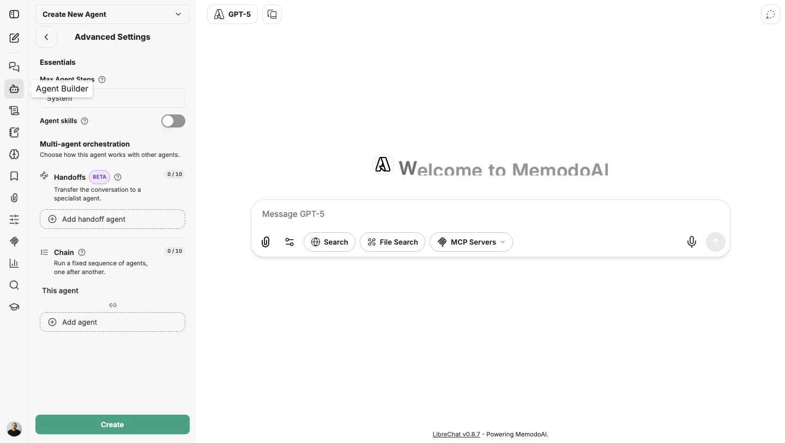

**What it is.** Chaining lets one agent run as a **sequence of steps within a single response** —
the output of one stage feeds the next — instead of doing everything in one pass.

**When it helps.** A task with genuinely distinct phases. For example, a "competitor brief" agent
could chain: (1) gather facts with web search → (2) structure them into a comparison table →
(3) write a one-paragraph takeaway. Each stage is focused and does one job well.

**The trade-off.** More steps mean **more tokens and more waiting**, and it's harder to see where a
result came from. Reach for chaining only when a single-pass prompt genuinely can't hold the task
together — most tasks don't need it.

### Memory — the assistant remembers what you tell it

MemodoAI's **Memories** feature (Getting Started §10) is now more active. Beyond quietly picking up
context, the assistant can **deliberately save something the moment you ask it to** — a preference,
an ongoing project, a fact worth keeping — writing it to your memory store mid-conversation.

**What you'll see.** The assistant confirms what it stored — e.g. *"Saved: You are on the Frontend
team"* — right in its reply, and the item then appears in the **Memories panel** (the brain icon in
the left rail), where you can read, edit, or delete it. Try: *"From now on, remember that I'm on the
Frontend team and prefer concise, bulleted answers."*

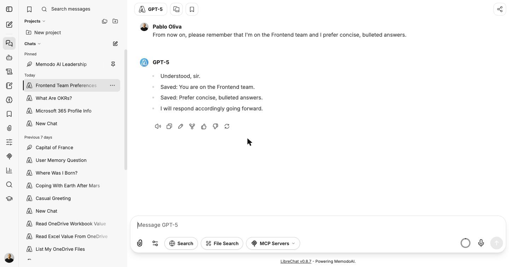

**It's yours, and optional.** Memories are tied to your account only. The memory toggle lets you
turn it off for a conversation or opt out entirely — and there's **nothing to set up per agent**; it
just applies wherever you chat unless you switch it off.

**When it helps.** Durable preferences and recurring context you'd otherwise retype. For a one-off
instruction that only matters in the current chat, you don't need it.

---

## 5. Projects — folders for your chats

You can now group related conversations into **Projects** — folders that appear at the top of the
conversation sidebar. It's the cleanest way to keep, say, all your "Q3 planning" chats together.

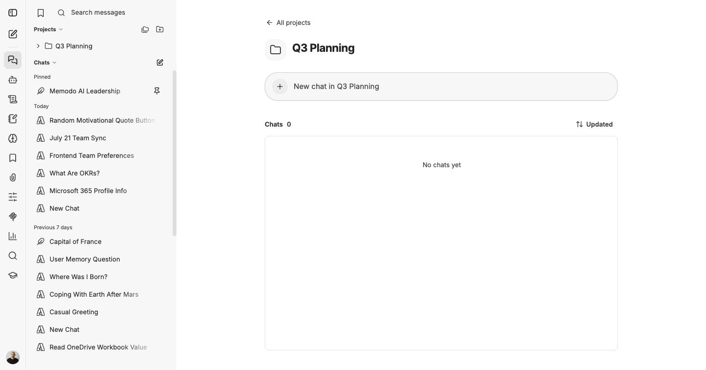

The Projects area **stays collapsed until you use it**, so it's out of the way if you don't.

**Projects vs. Bookmarks.** Both help you find chats later, but they solve different problems:
**Projects** *group* related conversations into a folder; **Bookmarks** (Getting Started §12) *tag*
individual conversations by theme so you can pull them up across projects. Use Projects for "these
belong together," Bookmarks for "I'll want to find this again."

---

## 6. Quality-of-life upgrades

Smaller changes you'll notice as you work:

- **Context-usage meter.** A small gauge shows how "full" the model's context window is — roughly,
  how much of the current conversation it can still hold in mind. Hover it for a breakdown. This is
  a **usage** indicator (token counts); it does **not** show a monetary cost. When a long chat
  starts to fill up, that's a good moment to start a fresh one.

  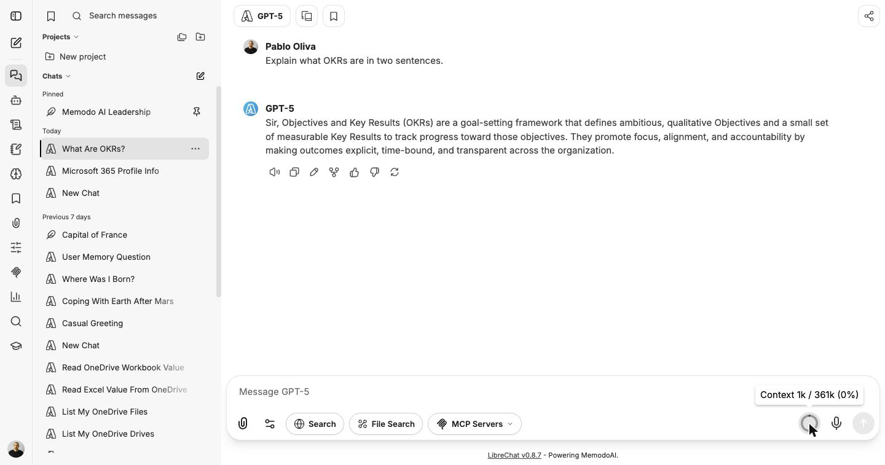

- **Instant chat titles.** New conversations get a descriptive title **immediately**, rather than
  after the first reply finishes.
- **Message timestamps on hover.** Hover any message to see when it was sent (e.g. "2 hours ago").

  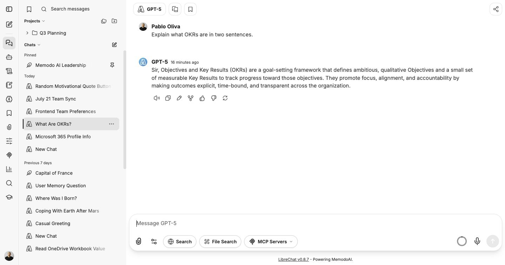

- **Richer file previews.** Word, Excel, PowerPoint, and CSV files now show as **rich inline
  previews** (a typed preview card — e.g. a "Spreadsheet") instead of plain download links.

  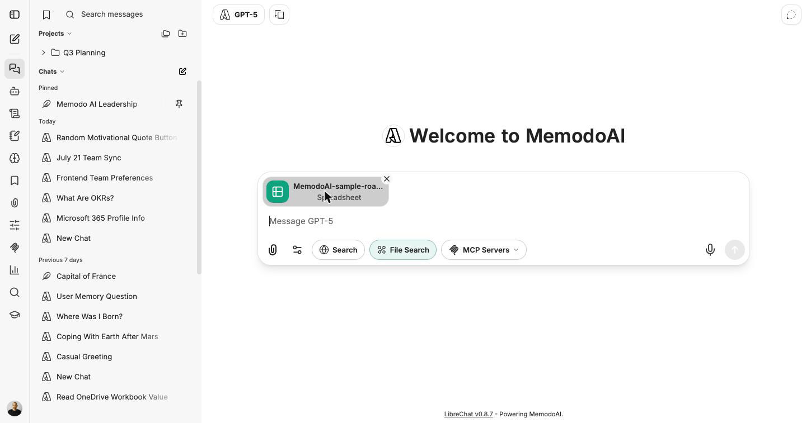

---

## 7. Where to learn more

- The **[Getting Started guide](../getting-started/memodo-ai-tutorial.md)** covers everything that hasn't changed —
  chatting, the model picker, agents, file search, memories, prompts, bookmarks, and the PII
  safety net.
- For Microsoft 365, remember it's **read-only** and works best when you name a specific target — a
  sender, a file, a keyword, a date range (section 2).
- For anything Memodo-specific — a custom agent misbehaving, sharing a skill with your team, or a
  bug — reach out to your **AI/IT champion** or the **Memodo Engineering Concierge** agent.

---

*July 2026 update — companion to the Getting Started guide. UI and screenshots verified on chat-test
(v0.8.7-rc1 + Microsoft 365); memory confirmed working 2026-07-23.*
